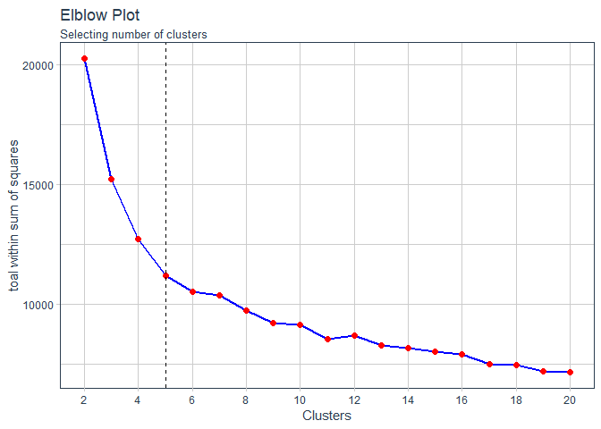

Content Based Filtering: Movie Recommendation
================

In this tutorial contente based filtering will be applied with kmeans clustering to recommend movies to users. Kmenas is applied to cluster the movies based on their similar genres they share. Data used in the analysis is the movielens dataset, which can be accessed [here](https://grouplens.org/datasets/movielens/).

Reference:(<http://rpubs.com/tim-dim/recommender>)

### Load library and data

``` r
library(tidyverse)
library(tidyquant)
```

There are two data sets, one with details on the movies and other with ratings for the movies given by the users.

#### Movies Data

``` r
# movies data
movies_tbl <- read_csv('ml-latest-small/movies.csv')

movies_tbl %>% head()
```

    ## # A tibble: 6 x 3
    ##   movieId title                         genres                             
    ##     <int> <chr>                         <chr>                              
    ## 1       1 Toy Story (1995)              Adventure|Animation|Children|Comed~
    ## 2       2 Jumanji (1995)                Adventure|Children|Fantasy         
    ## 3       3 Grumpier Old Men (1995)       Comedy|Romance                     
    ## 4       4 Waiting to Exhale (1995)      Comedy|Drama|Romance               
    ## 5       5 Father of the Bride Part II ~ Comedy                             
    ## 6       6 Heat (1995)                   Action|Crime|Thriller

The genres column will be split into separate cloumns for each genre.

There are movies for which the genre is given as 'no genres listed'. They will be converted as 'unknown'

``` r
movies_tbl %>% 
  filter(movieId == 182727)
```

    ## # A tibble: 1 x 3
    ##   movieId title                          genres            
    ##     <int> <chr>                          <chr>             
    ## 1  182727 A Christmas Story Live! (2017) (no genres listed)

``` r
movies_tbl <- movies_tbl %>% 
  mutate(genres = ifelse(genres == "(no genres listed)","unknown", genres))
```

Now we will sperate the genres column, for that, first we figure out the maximum number of genres a movie has.

``` r
movies_tbl %>% 
  mutate(a = str_count(genres,pattern = fixed("|"))) %>% 
  pull (a) %>% max()
```

    ## [1] 9

There are maximum of 10 genres for a movie. We will now separate the genres cloumn and reshape the movies\_tbl in the required format.

``` r
movies_tbl <- movies_tbl %>% 
  # separate genres into 10 clolumns
  separate(genres, into = c('a','b','c','d','e','f','g','h','i','j'),
           extra = 'merge', fill = 'right') %>% 
  gather(key,value,-movieId,-title) %>% 
  select(-key) %>% 
  #arrange(title) %>% 
  mutate(fill = 1) %>% 
  filter(!is.na(value)) %>% 
  spread(key = value,value = fill, fill = 0, drop = TRUE) %>% 
  add_column(genres = movies_tbl$genres) %>% 
  select(movieId,title,genres,everything())

movies_tbl %>% head()
```

    ## # A tibble: 6 x 26
    ##   movieId title genres Action Adventure Animation Children Comedy Crime
    ##     <int> <chr> <chr>   <dbl>     <dbl>     <dbl>    <dbl>  <dbl> <dbl>
    ## 1       1 Toy ~ Adven~      0         1         1        1      1     0
    ## 2       2 Juma~ Adven~      0         1         0        1      0     0
    ## 3       3 Grum~ Comed~      0         0         0        0      1     0
    ## 4       4 Wait~ Comed~      0         0         0        0      1     0
    ## 5       5 Fath~ Comedy      0         0         0        0      1     0
    ## 6       6 Heat~ Actio~      1         0         0        0      0     1
    ## # ... with 17 more variables: Documentary <dbl>, Drama <dbl>,
    ## #   Fantasy <dbl>, Fi <dbl>, Film <dbl>, Horror <dbl>, IMAX <dbl>,
    ## #   Musical <dbl>, Mystery <dbl>, Noir <dbl>, Romance <dbl>, Sci <dbl>,
    ## #   Thriller <dbl>, `Thriller|Western` <dbl>, unknown <dbl>, War <dbl>,
    ## #   Western <dbl>

We now have the data in the required format to perform kmeans clustering. The 1 and 0 in the columns created from genres states if the movie belongs to the genre or not.

#### User Data

Here is the user data, that has the information on the movies watched by the users and the ratings given.

``` r
user_tbl <- read_csv('ml-latest-small/ratings.csv')
```

    ## Parsed with column specification:
    ## cols(
    ##   userId = col_integer(),
    ##   movieId = col_integer(),
    ##   rating = col_double(),
    ##   timestamp = col_integer()
    ## )

``` r
user_tbl %>% head()
```

    ## # A tibble: 6 x 4
    ##   userId movieId rating timestamp
    ##    <int>   <int>  <dbl>     <int>
    ## 1      1       1      4 964982703
    ## 2      1       3      4 964981247
    ## 3      1       6      4 964982224
    ## 4      1      47      5 964983815
    ## 5      1      50      5 964982931
    ## 6      1      70      3 964982400

``` r
# remove timestamp
user_tbl <- select(user_tbl,-timestamp)
```

### Kmeans Clustering

We will now perform kmenas clustering with the movies\_tbl to cluster movies into similar clusters based on the genres they share.

``` r
# create a vector to store total sum of squares of the clusters
wss <- vector("numeric")

# list to store the cluster models
cluster_models <- list()

# we will perform kmeans clustering with 2 to 20 clusters and select the optimal clusters based on elbow method

for (k in 1:19){

  set.seed(1234)
  
  cluster_model <- kmeans(movies_tbl %>% select(-movieId,-title,-genres), 
                          centers = k+1, iter.max = 200, nstart = 25,
                          algorithm = 'Lloyd')

  wss <- c(wss,cluster_model$tot.withinss)
  
  cluster_models[[k]] <- cluster_model

}
```

``` r
# Plot the results

ggplot(tibble(k = 2:20, wss = wss), aes(k, wss))+
  geom_line(color = 'blue', size = 1)+
  geom_point(size = 2, color = 'red')+
  scale_x_continuous(breaks =  seq(2,20, 2))+
  geom_vline(xintercept = 5, linetype = 'dashed')+
  theme_tq()+
  labs(title = 'Elblow Plot',subtitle = "Selecting number of clusters",
       y = "toal within sum of squares", x = "Clusters")
```



From the elbow plot we can see the the total within sum of squares does not drop very much after 5 clusters or even 4 clusters and the drop is almost the same afterwards. For this analysis, we will take 5 clusters.

``` r
# Finally select kmeans cluster with 5 clusters

kmeans_cluster <- cluster_models[[4]]
```

Lets assign the movies their respective clusters.

``` r
movies_tbl <- movies_tbl %>% 
  mutate(cluster = kmeans_cluster$cluster)
```

### User Data

Here, we will get the movies that a user has watched and the associated ratings.

``` r
# function to extract user info

get_user_info <- function(user_data, user_id){
  
  user_info <- user_data %>% 
    filter(userId == user_id) %>% 
    select(movieId, rating) 
  
  return(user_info)
  
}

# test the function
get_user_info(user_tbl,1) 
```

    ## # A tibble: 232 x 2
    ##    movieId rating
    ##      <int>  <dbl>
    ##  1       1      4
    ##  2       3      4
    ##  3       6      4
    ##  4      47      5
    ##  5      50      5
    ##  6      70      3
    ##  7     101      5
    ##  8     110      4
    ##  9     151      5
    ## 10     157      5
    ## # ... with 222 more rows

### Assigning the clusters

Now, lets assign to the movies that the user has watched their respective clusters.

``` r
# function to assign the clusters for the movies active user has watched

assign_cluster <- function(movie_data, active_user){
  
  active_user <- active_user %>% 
    left_join(movie_data %>% select(movieId,cluster), by = 'movieId')
  
  return(active_user)
}

# test the funtion

assign_cluster(movies_tbl, active_user = get_user_info(user_tbl,1) )
```

    ## # A tibble: 232 x 3
    ##    movieId rating cluster
    ##      <int>  <dbl>   <int>
    ##  1       1      4       5
    ##  2       3      4       5
    ##  3       6      4       4
    ##  4      47      5       3
    ##  5      50      5       4
    ##  6      70      3       4
    ##  7     101      5       5
    ##  8     110      4       1
    ##  9     151      5       1
    ## 10     157      5       5
    ## # ... with 222 more rows

### Select the best cluster

We now calculate the mean ratings for each clusters of the movies that the user has watched and then select the cluster with the highest average rating as the most liked cluster by the user.

``` r
# get the mean cluster rating for the movies watched by the user and select the most highly rated cluster

select_best_cluster <- function(active_user){
  
  avg_cluster_rating <- active_user %>% 
    group_by(cluster) %>% 
    summarise(avg_rating = mean(rating)) %>% 
    ungroup()
  
  # if the max of avg_rating less than 3, we assign a value 0, else we select the cluster with max avg_rating
  
  if (max(avg_cluster_rating$avg_rating)< 3){
    best_cluster <- 0
  } else {
    best_cluster <- avg_cluster_rating %>% filter(avg_rating == max(avg_rating)) %>% pull(cluster)
  }
  return(best_cluster)
}


# test the function

user <- assign_cluster(movies_tbl, active_user = get_user_info(user_tbl,1) )

select_best_cluster(active_user = user)
```

    ## [1] 1

### Get the films from the cluster liked by the user

After we know the best cluster for the user, we now get all the movies from the best cluster. If the best cluster is 0 or if there are no cluster with &gt; 3 avg rating, we return random 100 movies

``` r
get_good_movies <- function(best_cluster, movie_data){
  
  if(best_cluster == 0){
    recommended_movies <- movie_data%>% 
      sample_n(size = 100) %>% 
      pull(title)
  } else {
    recommended_movies <- movie_data %>% 
      filter(cluster == best_cluster) %>% 
      select(movieId,title)
  }
  return(recommended_movies)
}

# test the function
get_good_movies(best_cluster = select_best_cluster(active_user = user), movies_tbl) %>% head(15)
```

    ## # A tibble: 15 x 2
    ##    movieId title                                               
    ##      <int> <chr>                                               
    ##  1       4 Waiting to Exhale (1995)                            
    ##  2      11 American President, The (1995)                      
    ##  3      14 Nixon (1995)                                        
    ##  4      16 Casino (1995)                                       
    ##  5      17 Sense and Sensibility (1995)                        
    ##  6      25 Leaving Las Vegas (1995)                            
    ##  7      26 Othello (1995)                                      
    ##  8      27 Now and Then (1995)                                 
    ##  9      28 Persuasion (1995)                                   
    ## 10      30 Shanghai Triad (Yao a yao yao dao waipo qiao) (1995)
    ## 11      31 Dangerous Minds (1995)                              
    ## 12      34 Babe (1995)                                         
    ## 13      36 Dead Man Walking (1995)                             
    ## 14      40 Cry, the Beloved Country (1995)                     
    ## 15      41 Richard III (1995)

### Get recommendations for the user

From the list of the movies from the best cluster, we now will recommend top n movies for the users.

Lets put all the fucntions together to recommend best movies for the user.

``` r
recommend_movies <- function(movie_data, user_data, user_id, n = 10){
  
  # get info about active user
  
  active_user <- get_user_info(user_data, user_id)
  
  # assigns the clusters for the movies active user has watched
  active_user <- assign_cluster(movie_data, active_user)
  
  # get the best cluster for the user
  best_cluster <-  select_best_cluster(active_user)
  
  # get movies to recommend from the best cluster
  movies_to_recommend <- get_good_movies(best_cluster,movie_data)
  
  #select only movies not watched by the user from the movies to recommend
  movies_to_recommend <- movies_to_recommend %>% 
    anti_join(active_user, by = 'movieId')
    
  # select the top_n movies that have highest average ratings among the users
  
 top_movieId <-  movies_to_recommend %>% 
    left_join(user_data, by = 'movieId') %>% 
    group_by(movieId) %>% 
    summarise(avg_rating = mean(rating)) %>% 
    ungroup() %>% 
    # select only movies with greater than 3 avg rating
    filter(avg_rating > 3) %>% 
    arrange(desc(avg_rating)) %>% 
    slice(1:n) 
    
 final_recommendation <- top_movieId %>% 
   left_join(movie_data, by = 'movieId') %>% 
   select(title, genres, avg_rating) %>% 
   rename('MOVIES YOU MAY ALSO LIKE' = title)
   

  return(final_recommendation)
  
}
```

Lets test our recommendation function

``` r
# test the function
recommend_movies(movie_data = movies_tbl,user_data = user_tbl,user_id = 6,n=15)
```

    ## # A tibble: 15 x 3
    ##    `MOVIES YOU MAY ALSO LIKE`                genres              avg_rating
    ##    <chr>                                     <chr>                    <dbl>
    ##  1 Lamerica (1994)                           Adventure|Drama              5
    ##  2 Awfully Big Adventure, An (1995)          Drama                        5
    ##  3 In the Realm of the Senses (Ai no corrid~ Drama                        5
    ##  4 What Happened Was... (1994)               Comedy|Drama|Roman~          5
    ##  5 Entertaining Angels: The Dorothy Day Sto~ Drama                        5
    ##  6 Lesson Faust (1994)                       Animation|Comedy|D~          5
    ##  7 Four Days in September (O Que É Isso, Co~ Drama                        5
    ##  8 Mephisto (1981)                           Drama|War                    5
    ##  9 Ballad of Narayama, The (Narayama bushik~ Drama                        5
    ## 10 On the Ropes (1999)                       Documentary|Drama            5
    ## 11 Man and a Woman, A (Un homme et une femm~ Drama|Romance                5
    ## 12 Red Sorghum (Hong gao liang) (1987)       Drama|War                    5
    ## 13 Sandpiper, The (1965)                     Drama|Romance                5
    ## 14 Madame Sousatzka (1988)                   Drama                        5
    ## 15 All the Vermeers in New York (1990)       Comedy|Drama|Roman~          5

Lets also see if our recommendation matches the user's preference.

**Most watched genres by the user**

``` r
user_tbl %>% 
  filter(userId == 6) %>%
     left_join(movies_tbl,by = 'movieId') %>% 
     select(title,rating,Action:Western) %>% 
     gather(key = genre, value = is_yes,factor_key = TRUE,-title,-rating) %>% 
     filter (is_yes == 1) %>% 
     # group_by(genre) %>% 
     # summarise(avg_rating = mean(rating)) %>% 
     # arrange(desc(avg_rating))
     count(genre, sort = T)
```

    ## # A tibble: 20 x 2
    ##    genre         n
    ##    <fct>     <int>
    ##  1 Drama       140
    ##  2 Comedy      127
    ##  3 Romance      70
    ##  4 Thriller     68
    ##  5 Action       64
    ##  6 Adventure    47
    ##  7 Children     47
    ##  8 Crime        35
    ##  9 Fantasy      26
    ## 10 Fi           21
    ## 11 Sci          21
    ## 12 Horror       19
    ## 13 Mystery      15
    ## 14 Animation    14
    ## 15 Musical      12
    ## 16 War          12
    ## 17 Western      11
    ## 18 IMAX          3
    ## 19 Film          2
    ## 20 Noir          2

We see our recommendation includes many movies of Drama genre,and other similar genres, which are also most watched genre by the user
